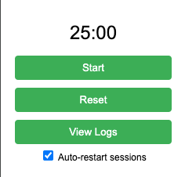

# Pomodoro Chrome Extension

A feature-rich Pomodoro Timer Chrome extension that helps you stay productive using the Pomodoro Technique. Track your work sessions, take structured breaks, and analyze your productivity patterns.



## Features

### Core Functionality
- 🕒 25-minute work sessions
- ⏸️ Pause/Resume capability
- 🔄 5-minute break intervals
- 📊 Session tracking and statistics
- 🔔 Visual notifications
- ⚡ Automatic session transitions

### User Interface
- 🎯 Clean, minimal popup interface
- 📱 Badge timer countdown on extension icon
- 🚦 Color-coded sessions (green for work, red for break)
- 👁️ Easy-to-read timer display

### Break Management
- 🆕 Dedicated break tab with countdown
- 🎨 Red-themed break interface
- 🔄 Auto-closing break tab
- ⚙️ Configurable auto-restart option
- 📝 **Interactive task management during breaks**
- ✅ **Task completion tracking and status updates**
- 🔄 **Smart task progression and workflow management**

### Analytics & Logging
- 📊 Google Sheets integration for session logging
- 📈 Real-time data export to your personal spreadsheet
- 🔐 Private and secure - data stays in your Google account
- 📅 Comprehensive session tracking with timestamps

### Task Management
- 📝 Load tasks from Google Sheets
- ✅ Track task progress with visual status indicators
- 📊 Task statistics dashboard (total, completed, pending)
- 🔄 Interactive status management (pending → in-progress → completed)
- 🔃 Refresh tasks while preserving progress
- 💾 Offline task access with local storage

## Installation

### From Chrome Web Store - TBD
1. ~~Visit the Chrome Web Store (link coming soon)~~
2. ~~Click "Add to Chrome"~~
3. ~~Confirm the installation~~

### Manual Installation (Developer Mode)
1. Clone this repository:
   ```bash
   git clone https://github.com/Gerontologytech/pomodoro.git
   ```
2. Open Chrome and navigate to `chrome://extensions/`
3. Enable "Developer mode" in the top right corner
4. Click "Load unpacked"
5. Select the extension directory

## Google Sheets Integration Setup

### 🔒 About Permissions & Security

**Don't worry about the permissions!** This integration is completely private and secure:

- ✅ **No Third-Party Servers**: Your data goes directly from the extension to YOUR Google Sheet
- ✅ **You Control Everything**: You deploy your own Google Apps Script in your Google account
- ✅ **Private & Secure**: Only YOU have access to your script and data
- ✅ **No External Services**: No data passes through our servers or any third-party
- ✅ **Open Source**: All code is visible and auditable in this repository

The permissions requested are only for YOUR script to read/write to YOUR spreadsheet - exactly like any other Google Sheets add-on you might use.

### How to Set Up Google Sheets Integration

Follow these steps to connect the extension to your personal Google Sheet. This process gives you full control over your data and script.

**Part A: Create Your Google Sheets**

1. **Create a New Google Sheet**: Go to [sheets.google.com](https://sheets.google.com) and create a new spreadsheet.
2. **Name Your Sheet**: Rename it to "Pomodoro Data" (or any name you prefer).
3. **Set Up Session Logging Sheet**: Create a sheet tab named "Logs" with these exact headers in the first row:

| A1 | B1 | C1 | D1 | E1 | F1 | G1 |
|---|---|---|---|---|---|---|
| **session date** | **session start time** | **session end time** | **session type** | **session duration** | **session completed** | **task name** |

Your "Logs" sheet should look like this:
```
A1: session date          B1: session start time    C1: session end time
D1: session type          E1: session duration       F1: session completed    G1: task name
```

4. **Set Up Task Management Sheet** *(Optional)*: Create another sheet tab named "Tasks" with these headers in the first row:

| A1 | B1 |
|---|---|
| **task** | **description** |

Your "Tasks" sheet should look like this:
```
A1: task                   B1: description
A2: Complete project report    B2: Write quarterly summary
A3: Review meeting notes       B3: Go through yesterday's notes
```

5. **Copy the Sheet ID**: From your sheet's URL (`https://docs.google.com/spreadsheets/d/SHEET_ID_HERE/edit`), copy the SHEET_ID part.

**Part B: Create and Deploy the Google Apps Script**

1. **Go to Google Apps Script**: Open [script.google.com](https://script.google.com) and click **New project**.
2. **Paste the Code**: Delete the default `function myFunction() {...}` and paste the entire contents of the `Code.gs` file from this repository.
3. **Configure the Script**:
   * Change the value of `SECRET_KEY` to a unique, private password of your choice.
   * Find the ID of your Google Sheet. It's in the URL: `.../spreadsheets/d/THIS_IS_THE_ID/edit`. Paste this ID as the value for `SHEET_ID`.
4. **Save the Project**: Click the floppy disk icon (Save project) and give it a name like "Pomodoro Timer Logger".
5. **Deploy as a Web App**:
   * Click the blue **Deploy** button in the top-right corner and select **New deployment**.
   * Click the gear icon next to "Select type" and choose **Web app**.
   * For "Execute as", select **Me**.
   * For "Who has access", select **Anyone**. *(This is safe because we are using a `SECRET_KEY`)*.
   * Click **Deploy**.
6. **Authorize Permissions**:
   * A popup will appear asking for authorization. Click **Authorize access**.
   * Choose your Google Account.
   * You may see a "Google hasn't verified this app" screen. This is normal. Click **Advanced**, then click **Go to [Your Script Name] (unsafe)**.
   * On the final screen, review the permissions (it will ask to access your spreadsheets) and click **Allow**.
7. **Copy the Web App URL**: After deploying, a new popup will show your **Web app URL**. Copy this URL. You will need it for the extension.

**Part C: Configure the Chrome Extension**

1. **Open the Extension**: Click the Pomodoro Timer extension icon in your browser.
2. **Setup Logging**: Click the "Setup Logging" button.
3. **Enable Logging**: Check the "Enable Session Logging" checkbox.
4. **Enter Details**:
   - Paste the **Web App URL** you copied into the "Google Sheets Web App URL" field
   - Enter the same **Secret Key** you created in the script
5. **Save**: Click "Save Settings". 

✅ **You're all set!** The extension will now automatically log your Pomodoro sessions to your Google Sheet. After saving, you'll see an "Edit Logs Settings" button for future changes.

## Usage

1. **Starting a Session**
   - Click the extension icon
   - Press "Start" to begin a 25-minute work session
   - The timer will be visible in both the popup and extension icon
   - **NEW**: Use "Mark Done" button to complete current task before timer ends
   - **NEW**: Use "Break (Test)" button to force break mode for testing

2. **During Breaks** *(Enhanced with Task Management)*
   - A new tab will automatically open when break time starts
   - **NEW**: See the task you worked on during the last session
   - **NEW**: Answer "Did you finish this task?" to update task status
   - **NEW**: For unfinished tasks, choose to continue or move to the next task
   - **NEW**: Preview what task you'll work on in the next session
   - **NEW**: Click "I finished my break, let's start the next session" to end break early
   - **NEW**: When task marked complete early, break page shows simplified view with next task
   - The break tab will close automatically after 5 minutes
   - If auto-restart is enabled, a new work session will begin

3. **Session Logging** *(Optional)*
   - Enable/disable logging anytime with the checkbox in settings
   - When enabled, sessions are automatically logged to your Google Sheet
   - Both completed and incomplete sessions are tracked
   - Data logged: Date, Start Time, End Time, Session Type, Duration (minutes), Completion Status, Task Name

4. **Task Management** *(Enhanced Feature)*
   - Click the "Task Manager" button in the extension popup
   - Enter your Google Sheets task tab name (e.g., "Tasks")
   - Click "Load Tasks" to import your tasks from the spreadsheet
   - Click "View Tasks" to open the task management interface
   - Track progress by cycling through: Pending → In Progress → Completed
   - Refresh tasks anytime while preserving your progress
   
   **Enhanced Break Page Task Management:**
   - During breaks, the system shows the task from your last work session
   - Interactive buttons let you mark tasks as completed or continue working on them
   - Smart workflow: If you mark a task complete, the next pending task becomes active
   - If you're not done, choose to continue the same task or move to the next one
   - See a preview of your next work session's task before the break ends
   - **NEW**: When task completed early via popup, break shows simplified view
   - **NEW**: Break control - end break early and start next session immediately

5. **Enhanced Workflow Controls** *(New Features)*
   - **Early Task Completion**: Mark tasks as done before session ends via popup
   - **Break Control**: End breaks early and immediately start next work session  
   - **Testing Mode**: Force break page to open for testing workflows
   - **Smart Task Progression**: Automatically advances to next pending task when current is completed

6. **Customization**
   - Toggle auto-restart functionality
   - Enable/disable session logging
   - Edit Google Sheets integration settings anytime
   - Manage tasks from your Google Sheets

## Project Structure

```
pomodoro-chrome-extension/
├── manifest.json
├── popup.html
├── popup.js
├── background.js
├── break.html
├── break.js
├── tasks.html           # Task management interface
├── tasks.js             # Task management logic
├── Code.gs              # Google Apps Script for users
├── icons/
│   ├── icon16.png
│   ├── icon48.png
│   └── icon128.png
├── assets/
│   ├── screenshot.png
└── README.md
```

## Development

Want to contribute? Great! Here's how:

1. Fork the repository
2. Create a new branch (`git checkout -b feature/improvement`)
3. Make your changes
4. Commit your changes (`git commit -am 'Add new feature'`)
5. Push to the branch (`git push origin feature/improvement`)
6. Create a Pull Request

## Troubleshooting

- **Timer not showing in icon?** Make sure you have the latest Chrome version
- **Break tab not opening?** Check if pop-ups are allowed for the extension
- **Stats not saving?** Verify that storage permission is granted

## License

MIT License

Copyright (c) [2025] [Eyal Silberman]

Permission is hereby granted, free of charge, to any person obtaining a copy
of this software and associated documentation files (the "Software"), to deal
in the Software without restriction, including without limitation the rights
to use, copy, modify, merge, publish, distribute, sublicense, and/or sell
copies of the Software, and to permit persons to whom the Software is
furnished to do so, subject to the following conditions:

The above copyright notice and this permission notice shall be included in all
copies or substantial portions of the Software.

THE SOFTWARE IS PROVIDED "AS IS", WITHOUT WARRANTY OF ANY KIND, EXPRESS OR
IMPLIED, INCLUDING BUT NOT LIMITED TO THE WARRANTIES OF MERCHANTABILITY,
FITNESS FOR A PARTICULAR PURPOSE AND NONINFRINGEMENT. IN NO EVENT SHALL THE
AUTHORS OR COPYRIGHT HOLDERS BE LIABLE FOR ANY CLAIM, DAMAGES OR OTHER
LIABILITY, WHETHER IN AN ACTION OF CONTRACT, TORT OR OTHERWISE, ARISING FROM,
OUT OF OR IN CONNECTION WITH THE SOFTWARE OR THE USE OR OTHER DEALINGS IN THE
SOFTWARE.

## Contributing

Contributions are what make the open source community such an amazing place to learn, inspire, and create. Any contributions you make are **greatly appreciated**.

See [Contributing Guidelines](CONTRIBUTING.md) for more information.

## Acknowledgments

- Inspired by the Pomodoro Technique by Francesco Cirillo
- Icon designs created with care for optimal visibility
- Built with modern Chrome Extension APIs

## Future Plans

- [ ] Customizable work/break durations
- [ ] Sound notifications
- [ ] Dark mode support
- [x] ~~Task management system~~ ✅ **Completed!**
- [x] ~~Integration with Pomodoro sessions (auto-advance tasks)~~ ✅ **Completed!**
- [x] ~~Enhanced break page with task management~~ ✅ **Completed!**
- [ ] Task filtering and search
- [ ] Task time tracking and analytics
- [ ] Integration with productivity tools
- [ ] Mobile sync support
- [ ] Keyboard shortcuts for task decisions

## Contact

Eyal Silberman - eyal.silberman@gmail.com

Project Link: [https://github.com/EyalSilberman/pomodoro.git](https://github.com/EyalSilberman/pomodoro.git)